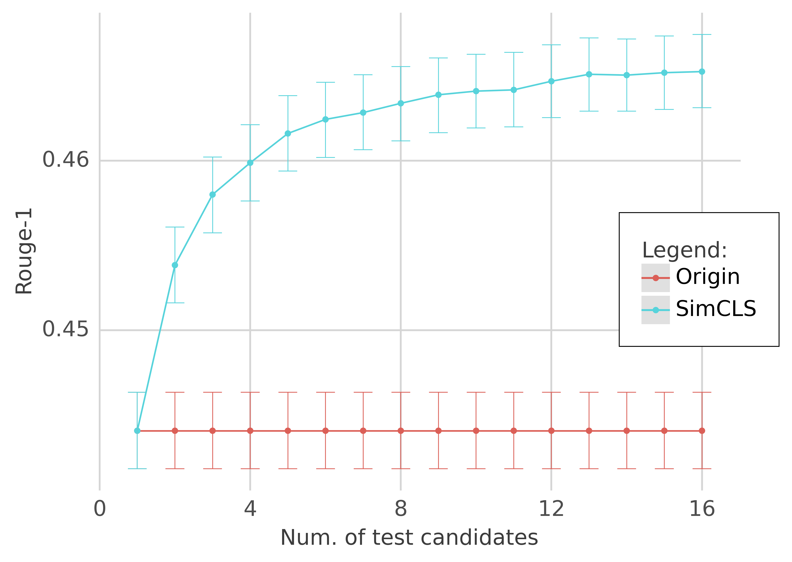
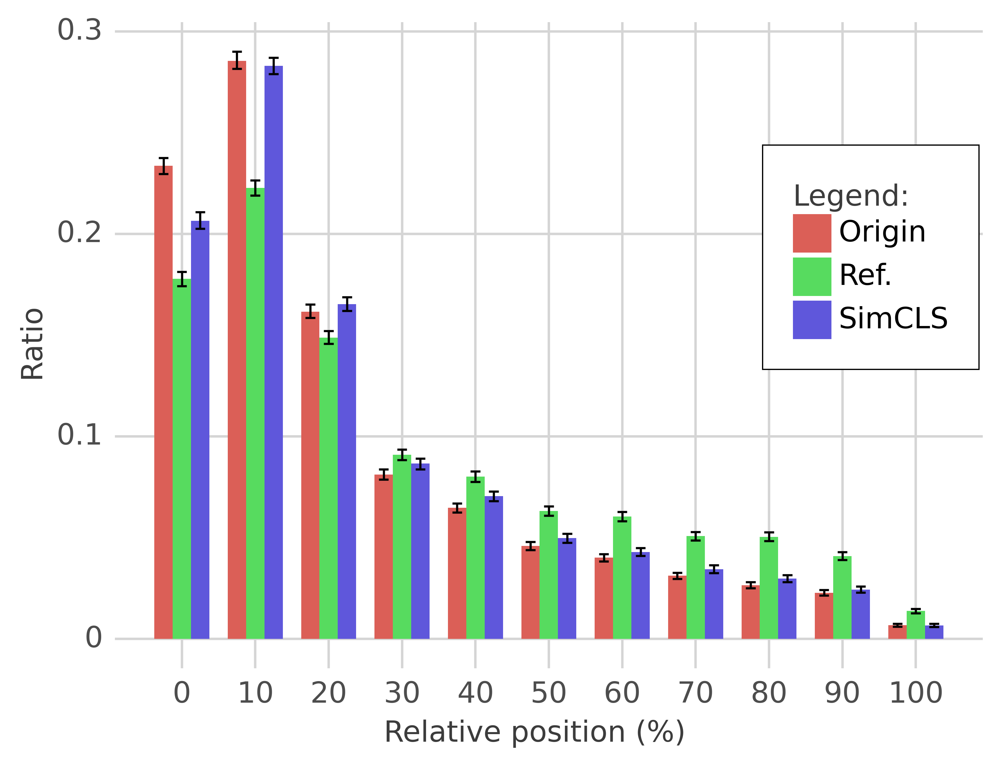

## SimCLS: A Simple Framework for Contrastive Learning of Abstractive Summarization

PyTorch reimplementation of the work described in [SimCLS: A Simple Framework for Contrastive Learning of Abstractive Summarization](https://arxiv.org/abs/2106.01890) published at [ACL 2021](https://aclanthology.org/2021.acl-short.135.pdf).

This project was part of the reproducibility challenge in the Machine Learning II Course at [DataScience Master's at the University of Ljubljana](https://datascience.fri.uni-lj.si/).

## Usage

Check in Google Colab: [](https://colab.research.google.com/github/andrejmiscic/simcls-pytorch/blob/main/notebooks/simcls_testing.ipynb)

or

```bash
git clone https://github.com/andrejmiscic/simcls-pytorch.git
cd simcls-pytorch
pip3 install torch torchvision torchaudio transformers sentencepiece
```

```python
from src.model import SimCLS, GeneratorType

# example for CNN/DailyMail summarization
summarizer = SimCLS(generator_type=GeneratorType.Bart,
                    generator_path="facebook/bart-large-cnn",
                    scorer_path="andrejmiscic/simcls-scorer-cnndm")

article = "This is a news article."
summary = summarizer(article)
print(summary)
```

You can check out `notebooks/simcls-testing.ipynb` for more examples ([colab link](https://colab.research.google.com/github/andrejmiscic/simcls-pytorch/blob/main/notebooks/simcls_testing.ipynb)).

All the models are available at Hugging Face Hub for easy usage:

| Dataset | Generator                                                                 | Scorer                                                                                          |
|---------|---------------------------------------------------------------------------|-------------------------------------------------------------------------------------------------|
| CNNDM   | [facebook/bart-large-cnn](https://huggingface.co/facebook/bart-large-cnn) | [andrejmiscic/simcls-scorer-cnndm](https://huggingface.co/andrejmiscic/simcls-scorer-cnndm)     |
| XSum    | [google/pegasus-xsum](https://huggingface.co/google/pegasus-xsum)         | [andrejmiscic/simcls-scorer-xsum](https://huggingface.co/andrejmiscic/simcls-scorer-xsum)       |
| BillSum | [google/pegasus-billsum](https://huggingface.co/google/pegasus-billsum)     | [andrejmiscic/simcls-scorer-billsum](https://huggingface.co/andrejmiscic/simcls-scorer-billsum) |


## Reproducibility

Important folders:
- `src/` contains all the code to build datasets, train, evaluate models and reproduce results of other experiments
- `run/` contains bash scripts with predefined parameters to run dataset building, training and evaluation

#### 1. Setup

```bash
git clone https://github.com/andrejmiscic/simcls-pytorch.git
cd simcls-pytorch

virtualenv venv
source venv/bin/activate
pip install -r requirements.txt
```
#### 2. Build datasets
The project currently supports CNNDM, XSum and BillSum datasets, however, more can be added by modifying `src/dataset_builder.py`.

You can build the SimCLS data for the aforementioned datasets by simply running the accompanying bash scripts:
```bash
bash run/build_cnndm_dataset.sh  # or build_xsum_dataset.sh or build_billsum_dataset.sh
```

If you want to modify the default parameters, you can get a list of all the options in `src/dataset_builder.py` or by running `python src/dataset_builder.py --help`.

#### 3. Training / evaluation

To train and test the models you can also use accompanying bash scripts with predefined parameters:

```bash
bash run/train_test_cnndm.sh  # or train_test_xsum.sh or train_test_billsum.sh
```
The script will additionally evaluate baseline approaches on the provided test set.
The list of all possible hyperparameters is available in `src/main.py` or by running `python src/main.py --help`.

#### 4. Additional experiments

Besides the standard ROUGE evaluation of the models, the authors also carry out a fine-grained analysis (on entity- and sentence-level) on the CNN/DM dataset.

You can run these additional experiments with:
```bash
bash run/cnndm_experiments.sh
```

This will produce a `figures/` directory with visualizations of positional bias and the effect of the number of candidates. Additionally, it will print out the entity and sentences alignment performance.

## Results

All of our results are reported together with 95% confidence intervals computed using 10000 iterations of bootstrap.

#### CNN/DM

| System           |               Rouge-1 |               Rouge-2 |               Rouge-L |
|------------------|----------------------:|----------------------:|----------------------:|
| BART             |                 44.16 |                 21.28 |                 40.90 |
| **SimCLS paper** |          ---          |          ---          |          ---          |
| Origin           |                 44.39 |                 21.21 |                 41.28 |
| Min              |                 33.17 |                 11.67 |                 30.77 |
| Max              |                 54.36 |                 28.73 |                 50.77 |
| Random           |                 43.98 |                 20.06 |                 40.94 |
| **SimCLS**       |                 46.67 |                 22.15 |                 43.54 |
|  **Our results** |          ---          |          ---          |          ---          |
| Origin           | 44.41, [44.18, 44.63] | 21.05, [20.80, 21.29] | 41.53, [41.30, 41.75] |
| Min              | 33.43, [33.25, 33.62] | 10.97, [10.82, 11.12] | 30.57, [30.40, 30.74] |
| Max              | 53.87, [53.67, 54.08] | 29.72, [29.47, 29.98] | 51.13, [50.92, 51.34] |
| Random           | 43.94, [43.73, 44.16] | 20.09, [19.86, 20.31] | 41.06, [40.85, 41.27] |
| **SimCLS**       | 46.53, [46.32, 46.75] | 22.14, [21.91, 22.37] | 43.56, [43.34, 43.78] |


#### XSum

| System           |               Rouge-1 |               Rouge-2 |               Rouge-L |
|------------------|----------------------:|----------------------:|----------------------:|
| Pegasus          |                 47.21 |                 24.56 |                 39.25 |
| **SimCLS paper** |          ---          |          ---          |          ---          |
| Origin           |                 47.10 |                 24.53 |                 39.23 |
| Min              |                 40.97 |                 19.18 |                 33.68 |
| Max              |                 52.45 |                 28.28 |                 43.36 |
| Random           |                 46.72 |                 23.64 |                 38.55 |
| **SimCLS**       |                 47.61 |                 24.57 |                 39.44 |
|  **Our results** |          ---          |          ---          |          ---          |
| Origin           | 47.16, [46.85, 47.48] | 24.59, [24.25, 24.92] | 39.30, [38.96, 39.62] |
| Min              | 41.06, [40.76, 41.34] | 18.30, [18.03, 18.56] | 32.70, [32.42, 32.97] |
| Max              | 51.83, [51.53, 52.14] | 28.92, [28.57, 29.26] | 44.02, [43.69, 44.36] |
| Random           | 46.47, [46.17, 46.78] | 23.45, [23.13, 23.77] | 38.28, [37.96, 38.60] |
| **SimCLS**       | 47.17, [46.87, 47.46] | 23.90, [23.59, 24.23] | 38.96, [38.64, 39.29] |

#### BillSum

| System          |               Rouge-1 |               Rouge-2 |              Rouge-L\* |
|-----------------|----------------------:|----------------------:|----------------------:|
| Pegasus         |                 57.31 |                 40.19 |                 45.82 |
| **Our results** |          ---          |          ---          |          ---          |
| Origin          | 56.24, [55.74, 56.74] | 37.46, [36.89, 38.03] | 50.71, [50.19, 51.22] |
| Min             | 44.37, [43.85, 44.89] | 25.75, [25.30, 26.22] | 38.68, [38.18, 39.16] |
| Max             | 62.88, [62.42, 63.33] | 43.96, [43.39, 44.54] | 57.50, [57.01, 58.00] |
| Random          | 54.93, [54.43, 55.43] | 35.42, [34.85, 35.97] | 49.19, [48.68, 49.70] |
| **SimCLS**      | 57.49, [57.01, 58.00] | 38.54, [37.98, 39.10] | 51.91, [51.39, 52.43] |

\* we used summary level Rouge-L which could explain the substantial difference with Pegasus results

#### Additional experiments

<table><thead><tr><th></th><th></th><th colspan="3">SimCLS paper</th><th colspan="3">Our results</th></tr></thead><tbody><tr><td></td><td></td><td>Prec.</td><td>Recall</td><td>F-1</td><td>Precision</td><td>Recall</td><td>F-1</td></tr><tr><td rowspan="2">entity-level</td><td>Origin</td><td>40.70</td><td>59.13</td><td>48.22</td><td>35.39, [34.93, 35.84]</td><td>41.27, [40.74, 41.80]</td><td>38.11, [37.65, 38.55]</td></tr><tr><td>SimCLS</td><td>43.36</td><td>59.79</td><td>50.27</td><td>36.41, [35.95, 36.88]</td><td>42.62, [42.10, 43.14]</td><td>39.27, [38.82, 39.72]</td></tr><tr><td rowspan="2">sentence-level</td><td>Origin</td><td>38.11</td><td>38.65</td><td>37.18</td><td>38.07, [37.62, 38.52]</td><td>38.20, [37.73, 38.66]</td><td>38.13, [37.69, 38.57]</td></tr><tr><td>SimCLS</td><td>42.58</td><td>40.22</td><td>40.12</td><td>40.30, [39.85, 40.75]</td><td>40.72, [40.26, 41.19]</td><td>40.51, [40.07, 40.95]</td></tr></tbody></table>

Rouge-1 with different num. of candidates             |  Positional bias of aligned sentences
:-------------------------:|:-------------------------:
  |  


### References & Citations

* [Official SimCLS implementation](https://github.com/yixinL7/SimCLS)

```bibtex
@inproceedings{liu-liu-2021-simcls,
    title = "{S}im{CLS}: A Simple Framework for Contrastive Learning of Abstractive Summarization",
    author = "Liu, Yixin  and
      Liu, Pengfei",
    booktitle = "Proceedings of the 59th Annual Meeting of the Association for Computational Linguistics and the 11th International Joint Conference on Natural Language Processing (Volume 2: Short Papers)",
    month = aug,
    year = "2021",
    address = "Online",
    publisher = "Association for Computational Linguistics",
    url = "https://aclanthology.org/2021.acl-short.135",
    doi = "10.18653/v1/2021.acl-short.135",
    pages = "1065--1072",
}
```


